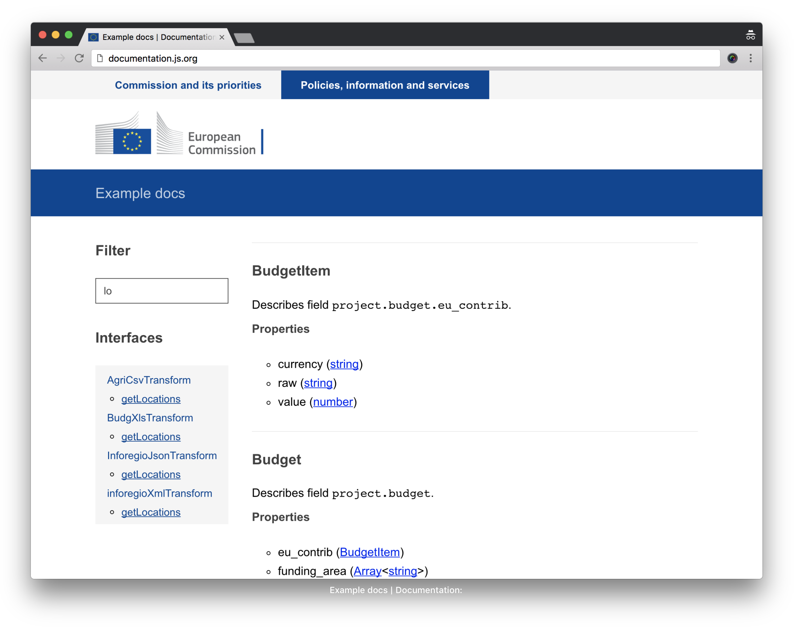

# ECL theme for documentation.js

This is a custom theme for [documentation.js](http://documentation.js.org): it consists of underscore templates and a few assets: a [highlight.js](https://highlightjs.org/) theme and the base of [ECL](https://github.com/ec-europa/europa-component-library)



## Usage

### CLI

Use the [documentation.js CLI](https://github.com/documentationjs/documentation/blob/master/docs/USAGE.md)

Example:

```bash
$ npx documentation build **/_types/*.js --theme . -f html -o example/app
```

Where the `--theme` flag should point to the module (index.js) of the theme.

### Node API

See [the html generation script](./example/scripts/docs-html.js) for an example of the
`formats.html` method as pointed out in the [documentation pages](https://github.com/documentationjs/documentation/blob/master/docs/NODE_API.md).

## Theme development

Requirements:

* Node.js current (8.x)
* `yarn` or `npm`
* `wget` (downloading ECL releases)

### Build the example

```bash
$ node example/scripts/docs-html.js
```

This will generate an example site in `example/app` with the theme.

### Fire a server and listen for changes

```bash
$ npx documentation serve --watch **/_types/*.js **/lib/helper.js **/*._ --theme .
```

In this case, you will still need to refresh the page with the example app manually.

### Just code

```bash
$ yarn start
```

This is going to do create a working environment in `dist/` folder.

* clean older working environment
* download ECL release (< 1MB) and add it to the theme `vendor` folder
* bundle assets for the first time in specific folder `bundle`
* documentation build taking templates and generating markup

Then, when the above are ready, _watch tasks_ will start in parallel:

* documentation re-build
* assets' bundles rebuild
* hot [`reload`](https://www.npmjs.com/package/reload) server
